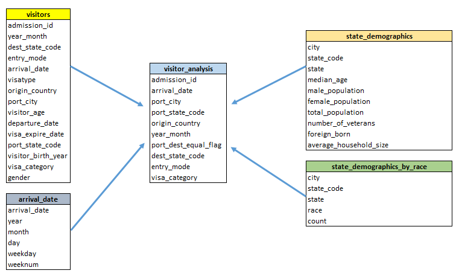

# **US Visitor Analysis Capstone**
## **Project Summary**
Visitor Analysis database enables users to analyze United States visitors by various elements. Database stores data sourced from 2016 US Visitor Arrivals Program (I94) activity and US Census Bureau's 2015 American Community Survey (only places with >65k population). Using the transformed data stored in this database, users can perform analysis like number of visitors by month, visa categories, origin country, port of entry, mode of entry. Additionally, users can utilize census statistics such as total population, average household size, diversity details for the given port city.

## **Conceptual Data Model**
Entity Relationship (ER) Model technique is used to design database structure. Conceptual data model (as displayed below) contains visitor_analysis as fact table and visitors, arrival_date, state_demographics, and state_demographics_by_race dimension tables. 

Above model allows users to perform basic visitors’ analysis such as visitors by port city or by visa categories quickly using the fact table, visitors_analysis. Additional detailed analysis can be performed by joining to other dimension tables.

## **Rationale for the choice of tools and technologies**
Technology stack used for pipelining the ETL process is Apache Spark (AWS EMR), AWS Redshift, AWS S3, and Python. Raw data from I94 and Demographics datasets along with three mapping tables are stored on AWS S3. AWS EMR cluster with Spark 2.0 is used for processing raw data and storing back on AWS S3 in JSON format. Following the transformations, data is copied to Redshift cluster in the STAR schema for end-user analysis. 

Spark’s in-memory, parallel computing, and fault-tolerant data processing capabilities provide efficiency in processing large datasets. In addition to core Spark benefits, using Spark on AWS EMR cloud service provides cost-effectiveness and hardware flexibility. As the data grows, one can efficiently add more nodes to EMR cluster in the matter of few minutes.

On the other hand, AWS Redshift provides Massively Parallel Processing RDBMS service that stores the data in relational database form. Data can be accessed through variety of Business Intelligence tools, providing an opportunity to connect from pre-existing BI tools that users are comfortable in. Redshift is petabyte-scale data warehouse as a result, growing data and user base can be adjusted for efficiently by adding more nodes to the cluster. Along with scaling up the hardware, more logical partitions can be added to the I94 tables for efficient query running with much larger data. 

## **Update Process**
Process of making data available for analysis include multiple steps which are performed in a sequential manner. To initiate the process, raw data from I94 and Census are stored on AWS S3 along with some mapping data that is used to decode certain attribute values in I94 dataset. These datasets are transformed into proposed Data Model using Spark DataFrame (DF). Data are read into the Spark using reader format specific to file, for example I94 data is read using SAS format reader as the data files are stored in SAS format. Each dataset is stored in its own DF and joined at a later stage to combine results.

Data cleaning in Spark involved, converting attribute data type into desired data type, for example, float data type for birth year is cast into INT data type. Converting SAS date numeric value to Spark DateType using UDF. Dropping duplicates, filling in defaults for NULL values, and joining to mapping DFs to decode coded attributes. Upon successfully cleaning the DF, transformed data is stored on AWS S3 in JSON format.

Transformed data is then copied into Redshift cluster using COPY command. For I94, data is first placed in staging tables where couple data quality checks are performed before performing INSERT statements. Checks involve, zero row count check and primary key uniqueness check. If either of checks fail, process stops and data engineer needs to investigate the situation. Alternatively, if the process checks out then staged data is inserted into I94 tables. Demographics data is directly copied to end-tables using COPY command followed by quality checks. Once the process is complete successfully, data is available to end-users for analysis.

Above mentioned process can be autonomously run using Apache Airflow workflow management platform. Airflow can be programmed to run at a pre-assigned schedule and the process can be monitored for any failures. Airflow or any other scheduler would be a preferred way to run this process if running any more frequently than monthly.

## **Manual Update Process Commands**  
Update demographics data once a year or whenever new data is available  
`spark-submit --master yarn --packages 'org.apache.hadoop:hadoop-aws:2.8.5 --conf spark.hadoop.fs.s3a.fast.upload=true demographics_data_processing.py`  

Process immigration data - monthly update  
Provide immigration file name as argument  
`spark-submit --master yarn --packages 'org.apache.hadoop:hadoop-aws:2.8.5 --packages 'saurfang:spark-sas7bdat:2.0.0-s_2.11 --conf spark.hadoop.fs.s3a.fast.upload=true immigration_data_processing.py 'i94_feb16_sub.sas7bdat`  

### If running ETL first time, run create_tables.py or else skip that step  
Create tables in Redshift  
`python3 create_tables.py`  

Extract demographics data from AWS S3 and load to Redshift  
`python3 load_demographics.py`  

Extract immigration data from AWS S3 and load to Redshift  
`python3 load_immigration.py`  

## **Proposed Update Schedule**
Both datasets are different in nature and use and therefore would require different schedules to update each. Census survey is usually performed once in multiple years. Hence, demographics data doesn’t need to be updated frequently. For this project, demographics is updated once a year. On the other hand, I94 data, in the current service is available in monthly, quarterly, and yearly subscriptions. Hence, it will need a more frequent update, as per the subscription. For the purpose of this project, I94 data is updated on a monthly schedule. Mapping data used to transform I94 dataset is also updated less frequently, only as more mapping keys are introduced. 
